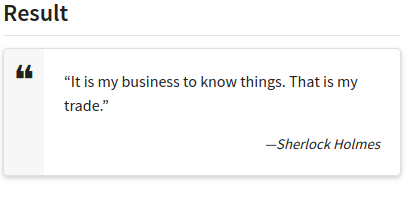

.. include:: /Includes.rst.txt
.. index:: Releases; v2.7
.. _Releases-v2-7:

=============
Releases v2.7
=============

.. contents::
   :backlinks: top
   :class: compact-list
   :local:

.. index:: Releases; v2.7.0

**************
Release v2.7.0
**************

December 16, 2020

.. attention::

   THIS PAGE IS WORK IN PROGRESS (WIP)

New: objects.inv.json
=====================

((to be written))

Each manual now has a :file:`objects.inv.json` as a sibling of the HTML start
page.

Example:

A start page: https://docs.typo3.org/m/typo3/T3DocsRenderingContainer/draft/en-us/Index.html

Sphinx creates a cryptic binary file with link information there:
https://docs.typo3.org/m/typo3/T3DocsRenderingContainer/draft/en-us/objects.inv

The rendering container now provides that information as a JSON file as well:
https://docs.typo3.org/m/typo3/T3DocsRenderingContainer/draft/en-us/objects.inv.json

New: Helper script dockrun_t3rd.bat for Windows
===============================================

((to be written))

Windows users now can use the helper script :file:`dockrun_t3rd.bat` similar
to the `dockrun_t3rd.sh` script for Linux and Mac users.

.. index:: Sphinx extension; sphinx.ext.graphviz

New: Graphviz
=============

((to be written))

Example: https://docs.typo3.org/m/typo3/demo-t3SphinxThemeRtd/master/en-us/Directives/sphinx_ext_graphviz.html

.. index:: Sphinx extension; sphinxcontrib-plantuml

New: Plantuml
=============

((to be written))

Examples: https://docs.typo3.org/m/typo3/demo-t3SphinxThemeRtd/master/en-us/Directives/sphinxcontrib-plantuml.html

.. index:: Sphinx extension; sphinx-tabs

New: sphinx-tabs
================

((to be written))

Examples: https://docs.typo3.org/m/typo3/demo-t3SphinxThemeRtd/master/en-us/Directives/sphinx-tabs.html

.. index:: HTML styling; Version hints

Improved: Styling of version hints
==================================

**Updated:** Versions hints are better visible now.

Example:

.. figure:: Files/v2-7-1-versionadded.png
   :class: with-border with-shadow
   :alt: Screenshot of various version hints

See https://docs.typo3.org/m/typo3/demo-t3SphinxThemeRtd/master/en-us/Directives/versionadded.html

.. index:: HTML styling; line blocks

Improved: Styling of line blocks
================================

**New:** Indentation levels are now shown correctly.

See the `reStructuredText Markup Specification`__ for a technical description
of `line blocks`__.

__ https://docutils.sourceforge.io/docs/ref/rst/restructuredtext.html
__ https://docutils.sourceforge.io/docs/ref/rst/restructuredtext.html#line-blocks

See `line blocks`__ in the `Demo docs`__.

__ https://docs.typo3.org/m/typo3/demo-t3SphinxThemeRtd/master/en-us/Lineblocks/Index.html
__ https://docs.typo3.org/m/typo3/demo-t3SphinxThemeRtd/master/en-us/

Example: "Crazy" indentation levels
-----------------------------------

.. image:: Files/v2-7-1-crazy-indentation-1-406.png
   :class: with-border with-shadow
   :alt: reST source of line block example

.. image:: Files/v2-7-1-crazy-indentation-2-406.png
   :class: with-border with-shadow
   :alt: HTML view of line block example

.. index:: HTML styling; block quotes

Improved: Styling of block quotes
=================================

**Improved:**
The attribution now appears aligned right and with a larger font size.

See the `reStructuredText Markup Specification`__ for a technical description
of `block quotes`__.

__ https://docutils.sourceforge.io/docs/ref/rst/restructuredtext.html
__ https://docutils.sourceforge.io/docs/ref/rst/restructuredtext.html#block-quotes

See `block quotes`__ in the `Demo docs`__.

__ https://docs.typo3.org/m/typo3/demo-t3SphinxThemeRtd/master/en-us/Blockquotes/Index.html
__ https://docs.typo3.org/m/typo3/demo-t3SphinxThemeRtd/master/en-us/

Example: Block quote
--------------------

.. image:: Files/v2-7-1-block-quote-1.png
   :class: with-border with-shadow
   :alt: reST source of block quote example

.. index:: HTML styling; extra wide screen

New: Making use of extra wide screens
=====================================

For the sake of good readability and "beauty" the HTML theme is limiting the
width of the content area to a certain maximum:

.. figure:: Files/v2-7-1-full-width-500-1.png
   :class: with-border with-shadow
   :alt: Screenshot of HTML page layout with limited content width

However, the larger your screen is the more space is wasted, which can be
annoying if you want to see extra wide tables or code blocks.

**New:** You can now make your browser window really wide (>1.800px) to trigger
a mode switch. With that all of your window will be used for content:

.. figure:: Files/v2-7-1-full-width-708-2.png
   :class: with-border with-shadow
   :alt: Screenshot of HTML page layout with full width content

Updated: Ubuntu 20.04
=====================

The container is now based on Ubuntu 20.04 LTS. The OS name and version is now
part of the 'versioninfo' output. When called with the `--version` option the
values for OS_NAME and OS_VERSION are shown as well:

.. figure:: Files/v2-7-1-version-output.png
   :class: with-border with-shadow
   :alt: Screenshot of the text output when called with the --version option

Updated: exclude_patterns
=========================

((to be written))

`exclude_patterns` can be specified in Defaults.cfg, Settings.cfg, Overrides.cfg

Updated: Better explanations in console output
==============================================

((to be written))

The container now does a better job in explaining at the end of the run why the
job has succeeded or failed.

.. index:: Sphinx extension; googlemaps

Removed: googlemaps
===================

The Sphinx extension `sphinxcontrib.googlemaps` was removed because it didn't
work any more.

.. index:: Sphinx extension; googlechart

Removed: googlechart
====================

The Sphinx extension `sphinxcontrib.googlechart` was removed because Google has
stopped that charting service.

.. index:: Releases; v2.7.1

**************
Release v2.7.1
**************

Released Jan 6, 2021

.. index:: HTML styling; Index page

New: Styled index page
======================

**New:** The index page now has CSS styling.

The list items on the index page :file:`genindex.html` are shown top-left
aligned without list symbols. The layout works well on small display like
cell phones:

.. figure:: Files/v2-7-1-index-page.png
   :class: with-border with-shadow
   :alt: Screenshot showing part of the index page

