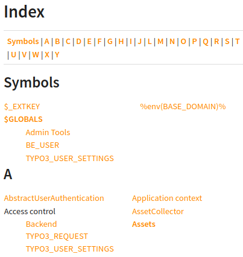
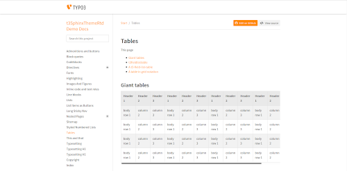
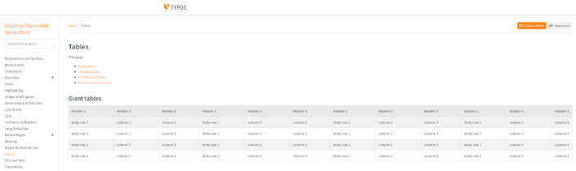
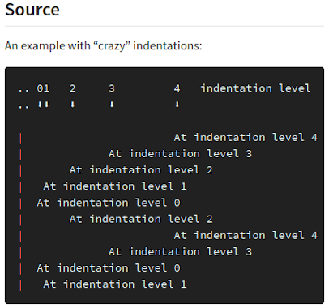
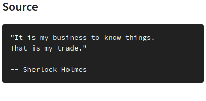
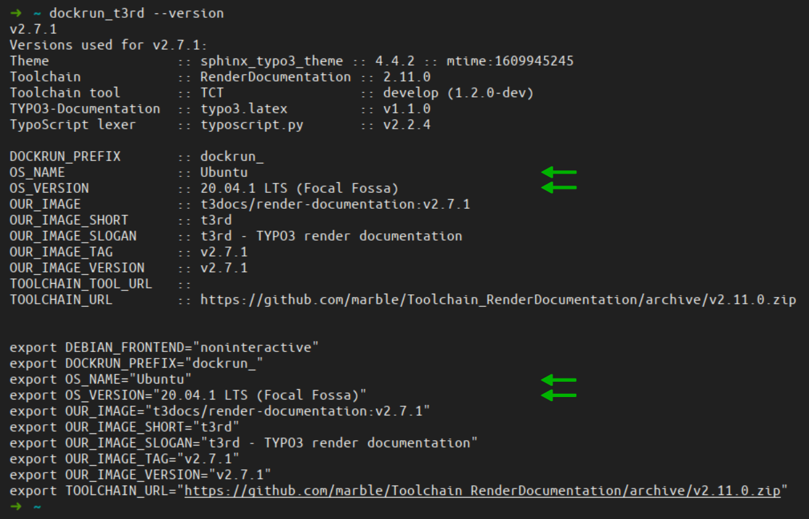

.. include:: /Includes.rst.txt
.. index:: Releases; v2.7
.. _Releases-v2-7:

==========================
Releases v2.7 (2021-01-21)
==========================

*  v2.7.0, December 16, 2020, lots of improvements
*  v2.7.1, Jan 6, 2021, style index page
*  v2.7.2, Jan 21, 2021, bugfix

.. contents::
   :backlinks: top
   :class: compact-list
   :local:

#############
NEW
#############

.. index:: HTML styling; Index page

NEW: Styled index page
======================

.. versionadded:: 2.7.1

The index page now has CSS styling.

The list items on the index page :file:`genindex.html` are shown top-left
aligned without list symbols. The layout works well on small display like
cell phones:

NEW: objects.inv.json
=====================

.. versionadded:: 2.7.0

**Each manual** now has a :file:`objects.inv.json` in its start folder.

Example:

A start page: https://docs.typo3.org/m/typo3/T3DocsRenderingContainer/draft/en-us/Index.html

Sphinx creates a cryptic binary file :file:`objects.inv` with link information in the manual's root
folder:
https://docs.typo3.org/m/typo3/T3DocsRenderingContainer/draft/en-us/objects.inv

The rendering container now provides that information as a
:file:`objects.inv.json` JSON file as well:
https://docs.typo3.org/m/typo3/T3DocsRenderingContainer/draft/en-us/objects.inv.json

NEW: Helper script dockrun_t3rd.bat for Windows
===============================================

.. versionadded:: 2.7.0

Windows users now can use the helper script :file:`dockrun_t3rd.bat` similar
to the `dockrun_t3rd.sh` script for Linux and Mac users.

.. index:: Sphinx extension; sphinx.ext.graphviz

NEW: Graphviz
=============

.. versionadded:: 2.7.0

Example: https://docs.typo3.org/m/typo3/demo-t3SphinxThemeRtd/master/en-us/Directives/sphinx_ext_graphviz.html

.. index:: Sphinx extension; sphinxcontrib-plantuml

NEW: Plantuml
=============

.. versionadded:: 2.7.0

Examples: https://docs.typo3.org/m/typo3/demo-t3SphinxThemeRtd/master/en-us/Directives/sphinxcontrib-plantuml.html

.. index:: Sphinx extension; sphinx-tabs

NEW: sphinx-tabs
================

.. versionadded:: 2.7.0

Examples: https://docs.typo3.org/m/typo3/demo-t3SphinxThemeRtd/master/en-us/Directives/sphinx-tabs.html

.. index:: HTML styling; extra wide screen
.. _NEW-Making-use-of-extra-wide-screens:

NEW: Making use of extra wide screens
=====================================

.. versionadded:: 2.7.0
.. versionchanged:: 2.8.0
   This feature was removed. We are awaiting a better solution.

For the sake of good readability and "beauty" the HTML theme is limiting the
width of the content area to a certain maximum:

However, the larger your screen is the more space is wasted, which can be
annoying if you want to see extra wide tables or code blocks.

**NEW:** You can now make your browser window really wide (>1.800px) to trigger
a mode switch. With that all of your window will be used for content:

#############
UPDATED
#############

.. index:: HTML styling; Version hints

UPDATED: Improve styling of version hints
=========================================

.. versionadded:: 2.7.0

Version hints are better visible now.

Example:

.. figure:: Files/v2-7/v2-7-1-versionadded.png
   :class: with-border with-shadow
   :alt: Screenshot of various version hints

See https://docs.typo3.org/m/typo3/demo-t3SphinxThemeRtd/master/en-us/Directives/versionadded.html

.. index:: HTML styling; line blocks

UPDATED: Improve styling of line blocks
=======================================

.. versionadded:: 2.7.0

Indentation levels are now shown correctly. The rendering is feature complete.

See the `reStructuredText Markup Specification`__ for a technical description
of `line blocks`__.

__ https://docutils.sourceforge.io/docs/ref/rst/restructuredtext.html
__ https://docutils.sourceforge.io/docs/ref/rst/restructuredtext.html#line-blocks

See `line blocks`__ in the `Demo docs`__.

__ https://docs.typo3.org/m/typo3/demo-t3SphinxThemeRtd/master/en-us/Lineblocks/Index.html
__ https://docs.typo3.org/m/typo3/demo-t3SphinxThemeRtd/master/en-us/

Example: "Crazy" indentation levels
-----------------------------------

.. image:: Files/v2-7/v2-7-1-crazy-indentation-2-406.png
   :class: with-border with-shadow
   :alt: HTML view of line block example

.. index:: HTML styling; block quotes

UPDATED: Improve styling of block quotes
========================================

.. versionadded:: 2.7.0

The attribution now appears aligned right and with a larger font size.

See the `reStructuredText Markup Specification`__ for a technical description
of `block quotes`__.

__ https://docutils.sourceforge.io/docs/ref/rst/restructuredtext.html
__ https://docutils.sourceforge.io/docs/ref/rst/restructuredtext.html#block-quotes

See `block quotes`__ in the `Demo docs`__.

__ https://docs.typo3.org/m/typo3/demo-t3SphinxThemeRtd/master/en-us/Blockquotes/Index.html
__ https://docs.typo3.org/m/typo3/demo-t3SphinxThemeRtd/master/en-us/

Example: Block quote
--------------------

.. image:: Files/v2-7/v2-7-1-block-quote-2.png
   :class: with-border with-shadow
   :alt: HTML view of block quote example

UPDATED: Use Ubuntu 20.04 as base image
=======================================

.. versionadded:: 2.7.0

The container is now based on Ubuntu 20.04 LTS. The OS name and version is now
part of the 'versioninfo' output. When called with the `--version` option the
values for OS_NAME and OS_VERSION are shown as well:

UPDATED: Allow exclude_patterns in settings files
=================================================

.. versionadded:: 2.7.0

`exclude_patterns` can be specified in Defaults.cfg, Settings.cfg, Overrides.cfg

UPDATED: Show better explanations in console output
===================================================

.. versionadded:: 2.7.0

The container now does a better job in explaining at the end of the run why the
job has succeeded or failed.

The final exit result will either be 0 or 255. The rendering is considered
successful if the main :file:`Index.html` file of the html-build exists. So in
this case the Docker container finishes with `exitCode=0`. Otherwise the final
result will be `exitCode=255` to signal failure.

#############
REMOVED
#############

.. index:: Sphinx extension; googlemaps

REMOVED: Sphinx extension googlemaps
====================================

.. versionchanged:: 2.7.0 Sphinx extension removed

The Sphinx extension `sphinxcontrib.googlemaps` was removed because it didn't
work any more.

.. index:: Sphinx extension; googlechart

REMOVED: Sphinx extension googlechart
=====================================

.. versionchanged:: 2.7.0 Sphinx extension removed

The Sphinx extension `sphinxcontrib.googlechart` was removed because Google has
stopped that charting service.
