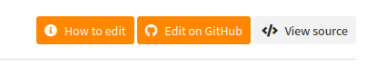
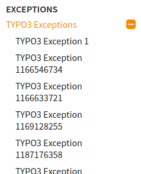

.. include:: /Includes.rst.txt
.. index:: Releases; v2.8
.. _Releases-v2-8:

==========================
Releases v2.8 (2021-03-27)
==========================

Release date v2.8.2: March 27, 2021

.. contents:: Page contents:
   :backlinks: top
   :class: compact-list
   :local:

###############################################
v2.8.3 (to be released, available as 'develop')
###############################################

Release date v2.8.3: To be released

Already available as `docker pull t3docs/render-documentation:develop`.

NEW: just1sphinxbuild functionality (speed!)
============================================

.. versionadded:: 2.8.3

According to TYPO3 conventions the documentation of a project should start with
file
:file:`./Documentation/Index.rst`. In this case and for a local rendering
("render while you type") it would be sufficient to just run a `sphinx-build`
command within the container and skip all the steps of the rendering tool chain.
When you start thinking in fractions of a second of rendering time this makes
a difference. You can now do that::

   dockrun_t3rd  just1sphinxbuild

This will trigger one `docker run` with all the necessary parameters for your
situation and then run a `sphinx-build` command within the container::

   /ALL/venv/.venv/bin/sphinx-build -v -v -v -b html -c /ALL/Makedir  -j auto \
   -T -q -w /RESULT/sphinx-build/warnings.txt -d /RESULT/Cache \
   /PROJECT/Documentation  /RESULT/Result/project/0.0.0/

If you are wondering what all those parameters mean have a look at the help that
`sphinx-build` offers::

   dockrun_t3rd  bashcmd  'sphinx-build --help'

An alternate, equivalent call to the `just1sphinxbuild` functionality would be::

   dockrun_t3rd  bashcmd  'python2 /ALL/Scripts/just1sphinxbuild.py'

To inspect what script that is you can run::

   dockrun_t3rd  export-ALL

Of course, you can then take that script from
:file:`Documentation-GENERATED-temp/ALL-exported/Scripts` and reuse it. You can
dig down deeper into the rabbit hole as you like.

Another way to use individual parameters would be this.

Run `makehtml` once to garantee that folders exist::

   dockrun_t3rd makehtml

Then directly run docker and the `sphinx-build` command - again and again::

   dockrun_t3rd \
      bashcmd \
         '\
         sphinx-build -v -v -v  \
         -b html \
         -c /ALL/Makedir \
         -j auto  -T \
         -q  \
         -w /RESULT/warnings.txt \
         -d /RESULT/Cache \
         /PROJECT/Documentation \
         /RESULT/Result/project/0.0.0/ \
         '

UPDATE: serve4build functionality (speed!)
==========================================

.. versionchanged:: 2.8.3 Code changes

`serve4build` takes the `just1sphinxbuild` functionality a step further. While
`just1sphinxbuild` does a complete container run for each call, `serve4build`
starts the container only once thereby launching a little webserver.

The webserver is mainly waiting for a rebuild request or for the shutdown
request. Some more helper actions are available.

1. Start the :term:`DRC` as build server:

   .. image:: Files/v2-8-3-Start-serve4build.png
      :class: with-border with-shadow
      :alt:   Starting serve4build

2. Then use your browser:

   .. image:: Files/v2-8-3-serve4build-browser.png
      :class: with-border with-shadow
      :alt:   serve4build in the browser

3. Or, instead of using this browser, issue a web request by some tool like
   *wget* or *curl*:

   .. image:: Files/v2-8-3-serve4build-wget.png
      :class: with-border with-shadow
      :alt:   serve4build via wget web request

#############
v2.8.2
#############

Release date v2.8.2: March 27, 2021

NEW: serve4build
================

See v2.8.3.

#############
v2.8.1
#############

Release date v2.8.2: March 26, 2021

*  The :term:`DRC` v2.8.1 uses v4.5.2 of the `sphinx-typo3-theme`_.

*  The target of the 'How to edit' button is now a theme configuration value
   `h2edit_url` and thus can be set in :file:`conf.py`. We are using
   :file:`Defaults.cfg`, :file:`Settings.cfg`, :file:`Overrides.cfg` and
   :file:`jobfile.json` to compose :file:`conf.py`. In official renderings for
   the TYPO3 docs server the value :file:`Overrides.cfg` defines this value as
   `h2edit_url =
   https://docs.typo3.org/m/typo3/docs-how-to-document/master/en-us/WritingDocsOfficial/GithubMethod.html`.

BUGFIX: Logo link area
======================

.. versionchanged:: 2.8.1 Bugfix logo

   The link area of the logo does not stretch into the shaded area past the
   actual image any more.

UPDATE: How to edit button
==========================

.. versionchanged:: 2.8.1 Show constantly

   The button is now shown constantly and not as an "on hovering" effect. It is
   not shown though if there is no "Edit on GitHub"-like button.

#############
v2.8.0
#############

Release date v2.8.0: March 16, 2021

NEW: How to edit button
=======================

.. versionadded:: 2.8.0

v2.8 of the :term:`DRC` is using v4.5 of the `sphinx-typo3-theme`_. The actual changes
are made in the theme.

At the top right of our pages we usually show the "Edit on GitHub" and "Show
source" buttons:

.. image:: Files/v2-8-0-Edit-on-GitHub-button.png
   :class: with-border with-shadow
   :alt:   Screenshot of the 'Edit on GitHub' button

It is desirable to give users help about what they have to expect when they
click the edit button. On the other hand we don't want to overload the
layout. As a solution there now is a third button which only appears while
hovering over the edit button:

.. image:: Files/v2-8-0-How-to-edit-button.png
   :class: with-border with-shadow
   :alt:   Screenshot of the 'How to edit' button

The "How to edit" button will take users to the `How to work with
GitHub <https://docs.typo3.org/m/typo3/docs-how-to-document/master/en-us/GitHub/>`__
page of the "Writing documentation" manual.

At the moment the link is hardcoded within the `sphinx-typo3-theme`_.

NEW: Sphinx can use parallel processes
======================================

We updated several Sphinx extensions. They now return the so called "extension
metadata" from their setup routine. They now signal True for "parallel_read_safe"
and "parallel_write_safe". We could verify that Sphinx now uses parallel
processes for writing. The extension `sphinxcontrib.t3targets` wasn't compatibel
with this change and got fixed.

NEW: Collapsed menu for TYPO3 Exceptions
========================================

.. versionadded:: 2.8.0

When TYPO3 throws an exception it often points to a page that is dealing with
that exception. See exceptions `1460976566
<https://docs.typo3.org/typo3cms/exceptions/master/en-us/Exceptions/1460976566.html>`__
for example. Usually the main menu at the left of the page is expanded to show
the menu item for the current page.
The theme.js that comes with `sphinx-typo3-theme`_ v4.5 has code that looks for
the 'TYPO3 Exceptions' item and collapses the submenu on page load.

Old: |expanded-menu|
New: |collapsed-menu|

.. |collapsed-menu| image:: Files/v2-8-0-Exceptions-menu-collapsed.png
   :alt:   Screenshot of the expanded menu with many items
   :class: with-border with-shadow

REMOVED: Full content width for extra wide screens
==================================================

.. versionchanged:: 2.8.0

Feature :ref:`NEW-Making-use-of-extra-wide-screens` was removed.
Instead, a better solution will be introduced in one of the next versions.
