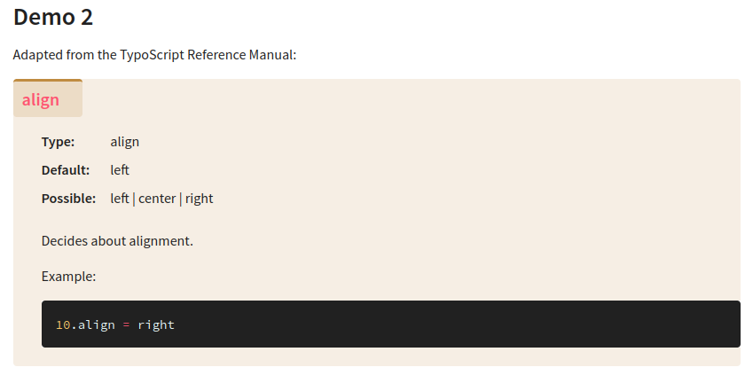

.. include:: /Includes.rst.txt
.. index:: Releases; v3.0.dev1
.. _Releases-v3-0-dev1:

===============================
Releases v3.0.dev1 (2021-10-03)
===============================

.. contents:: Page contents:
   :backlinks: top
   :class: compact-list
   :local:

#########
v3.0.dev1
#########

*  Release date v3.0.dev1: 2021-10-03

*  Published to docs server

.. attention::

   As of 2021-10-04 this version is not available from Docker hub yet. We first
   have to solve some license issues there.

   However you get the `source of this prerelease v3.0.dev1
   <https://github.com/t3docs/docker-render-documentation/releases/tag/v3.0.dev1>`__
   and do a `docker build` on your own.

NEW: Facility to show "version hints" on each page
==================================================

Readers often forget or don't notice that they are seeing the latest version
a manual. The included `v4.7.dev1 release
<https://github.com/TYPO3-Documentation/sphinx_typo3_theme/releases/tag/v4.7.dev1>`__
of our theme provides a solution. "version hints" can be shown on each
and every html page of a manual.

1. Each html page now provides a structure to fill in version hints:

   .. figure:: Files/v3-0/001.png
      :class: with-border with-shadow

   Fill the div :html:`div.version-hints-inner` with whatever you want to be
   shown.

   By default and for local renderings nothing will be shown.

2. When rendering for the docs server ajax is activated:

   .. figure:: Files/v3-0/002.png
      :class: with-border with-shadow

   As indicated in the comment ((todo!)) the content of file
   :file:`_static/ajax-version-hints.html` gets filled in using in ajax call.
   The means: The uploader of the manual only has to update a single file and
   all pages will come up showing that hint.

   Example of :file:`_static/ajax-version-hints.html`:

   .. figure:: Files/v3-0/003.png
      :class: with-border with-shadow

   The advantage of this solution is speed and simplicity: Version hints can be
   activated and modified by uploading a single file. Changes take effect
   immediately. Nothing needs to be rerendered and deployed.

   The drawback however is a short "blink" of all pages, because they load and
   display first and then adjust for the hint.

3. Another solution would be to turn ajax off and insert the hint directly into
   each html page like so. This avoids any flickering.

   .. figure:: Files/v3-0/004.png
      :class: with-border with-shadow

4. And here's an example of what you would see as result:

   .. figure:: Files/v3-0/005.png
      :class: with-border with-shadow

Ported to Python-3
==================

.. versionchanged:: 3.0

The biggest change of this release are internal: The container now uses Python-3
instead of outdated and unmaintained Python-2.

For being able to make this upgrade the toolchain `RenderDocumentation
<https://github.com/marble/Toolchain_RenderDocumentation>`_ was ported to PY3.

The toolchain was ported, but not refactored yet. This will be the next step
once the transistion to container v3.0 has been made.

For some Sphinx extensions we don't need a tailored "hacked-for-python2" version
any more.

Latest Sphinx v4.2.0 (was v1.8.5)
=================================

Because of PY3 we now can use the latest Sphinx version and thus have caught
up to the "state of the art" Sphinx. It now produces some slightly differen
html constructs. The `v4.7.dev1 release
<https://github.com/TYPO3-Documentation/sphinx_typo3_theme/releases/tag/v4.7.dev1>`__
of our Sphinx theme accounts for this and should be backwards compatible.

Fixed: Order of CSS files
=========================

Our own :file:`_static/theme.css` is now loaded AFTER Sphinx extension styles
have been loaded. So, for example, we can easily override `sphinx-tab` styles
and keep our font-family and border-colors.

Updated: Display of `.confval` blocks
=====================================

As an experiment and proposal the style of `.confval` sections was changed.
Example of the new appearance:

More changes
============

*  There now is a `make buildall` command.
*  …

